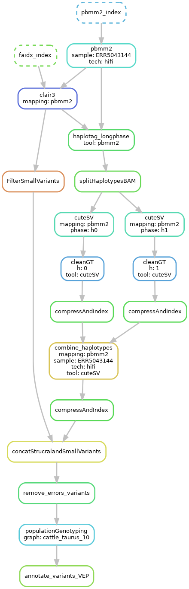

# 1) Intro

We are going to learn how to study structural variants (SV) in cattle
genomes using long reads from Pacbio and Oxford Nanopore.  We are
going to discover and phase small variants and SVs using state of the
art tools. After that, we are going to calculate population allele
frequencies using a novel population genotyper tool (The Great
Genotyper).  Lastly, we are going to functionally annotate the
variants to facilitate studying the functional impact of the SVs.

## Aims

1. learn how to call and phase SVs using the different SV callers
2. compare the performance of different methods
3. learn how to calculate population allele frequency for cattle SVs
4. learn how to predict the impact of SV on genes

# 2) Significance 

* Novel way of calculating Population AF without needing databases like genomAD, and more accurate too.
* Variants will be richly annotated with AF and predicted functional impact making it perfect for studying functional impact of the SVs.
* Workflow is benchmarked on cattle data and achieving accuracy of ~ 90%.
* Workflow is implemented using snakemake to make it simpler to run it afterward with your data and tweak it as you want.

# 3) Terminology

* Structural Variant: Genome variation of more than 50bp, it can be insertion, deletion, inversion, duplication, or translocation.
* haplotype-resolved assembly: Haplotype-resolved assembly is a method of generating a high-quality genome assembly that distinguishes between the two copies of each chromosome that an individual inherited, one from each parent. In other words, it allows researchers to separate and distinguish the unique DNA sequences inherited from an individual's mother and father. 
* Phased variant
* Population Allele frequency
* Snakemake
* Variant calling
* genotyping
* Population genotyping 


# 4) Data Description 

We chose sequencing datasets from the haplotype-resolved assembly
project (PRJEB42335) of Nellore and Brown_Swiss cross for two reasons:

1. We can create a gold standard benchmark by calling the variants
   from the haplotype-resolved assemblies which is considered to be
   the most accurate method (Figure 1).

2. The sample was heavily sequenced using Illumina, Pacbio(HIFI), and Oxford
   Nanopore which allows us to compare the results of different methods.  

||
|:--:|
|Figure 1: Comparison of different methods
Ref:  Mahmoud M, Gobet N, Cruz-Dávalos DI, Mounier N, Dessimoz C, Sedlazeck FJ. Structural variant calling: The long and the short of it. Genome Biology. 2019 Nov 20;20(1):246. 
|

Test input data for the workshop is available on farm at:
```
/home/mshokrof/workshop_12Jan_2023_data/
```

The following table describes the test input file:

| file        |  Description  |
|:-------------:|:-------------|
| ARS-UCD1.2_Btau5.0.1Y.25.fa | Chromosome 25 from ARS-UCD1.2 genome|
| ARS-UCD1.2_Btau5.0.1Y.25.rmsk.bed.gz | Repeats annotation of chromosome 25|
| ARS-UCD1.2_Btau5.0.1Y.25.gff.gz | genes annotation of chromosome 25|
| goldstandard/callset_filered.25.vcf.gz | gold standard for variant calling created using the haployte resolved assemblies|
| goldstandard/callset_filered.25.bed.gz | the gold standard in bed format for plotting|
| ERR5043144.chr25.fastq.gz | Hifi reads from sample SAMEA10017982 that maps to chromsome 25|
| ERR7091271.chr25.fastq.gz | ONT reads from sample SAMEA10017982 that maps to chromsome 25|
| cattle_taurus_10 |  Folder contains Kmer indexes of 10  taurus samples|
| vep/ | vep annotation data|

We created a downsampled the data for the sake of this workshop. We
are going to focus on chromsome 25 only, and we are going to calculate
the AF in 30 samples (but we can scale to 4000 samples).

# 5) Let's start configurations

## 5.1 Installing the environment

0. run a bash session on farm(UC Davis HPC)
This step creates a bash session and allocates 8 cores and 30GB RAM for it. 

```
 srun    -p high2 -t 10:00:00 -c 8  --mem=30G --pty bash
```
1. clone this repo:

```
git clone https://github.com/dib-lab/workshop_12Jan_2023.git
cd workshop_12Jan_2023/SV_calling_LR/
``` 

2. create the conda environment and install the tools
We preinstalled the envorioments for you to save the workshop time. You **don't have** to install it again and rerun the following commands.

```
conda install mamba -n base -c conda-forge
mamba env create -f envs.yaml
conda activate cattle_sv
```

All you need is to activate the conda environment

```
conda activate cattle_sv
```


3. make sure that you can access the input files

```
ls -lsah  /home/mshokrof/workshop_12Jan_2023_data/ARS-UCD1.2_Btau5.0.1Y.25.fa
```

The workflow expects the input files to be stored in
`samples_table.csv` and `subsample_table.csv`, and the configurations
in `config.yaml`.

## 5.2 Edit config.yaml
1. open config.yaml using nano
```
nano config.yaml
```

2. change the outputFolder and tempFolder to desired folders. We can just leave the default options

3. close by pressing ctrl+x then Y then enter

## 5.3 Edit sample_table.csv

We should fill `sample_table.csv` with the metadata about our
datasets. It is in csv format where each row represents a dataset. For
each dataset, we add three comma separated columns:

1. sample_name: id for each dataset
2. sample_type: we define here the type for the datasets using the following types

    | Type        | Defention             |
    | ------------- |:-------------:|
    | ref      | reference genome |
    | gff      | genes annotation of the reference  |
    | rmsk     | repeat annotation of the reference |
    | gold     | gold standard for Variant calling  |
    | ont      | Oxford Nanopore sample |
    | hifi     | Pacbio Hifi sample|
    | clr      | Pacbio CLR sample|

3. bioSample: the biosample id of each dataset. 

We are going to define 8 datasets: reference genome, repeat
annotation, gene annotation, gold standard vcf format, gold standard
bed format, ont sample, hifi sample, and a cohort graph.

Open sample_table.csv and paste the following lines under the header:
```
ucd1.2,ref,SAMN03145444
ucd1.2_gff,gff,SAMN03145444
ucd1.2_rmsk,rmsk,SAMN03145444
NxB,gold,SAMEA7765441
ERR5043144,hifi,SAMEA7765441
ERR7091271,ont,SAMEA7765441
cattle_taurus_10,graph,COHORT
```

The sample_type selects the workflow to execute - for example,
incorrectly specifying ERR5043144 as hifi will change the mapping tool
to pbmm2 and will call SVs with cuteSV.


## 5.4 Edit subsample_table.csv

we are going to specify the files for each dataset. 
open subsample_table.csv using emacs and  copy paste the following lines under the header line

```
ucd1.2,/home/mshokrof/workshop_12Jan_2023_data/ARS-UCD1.2_Btau5.0.1Y.25.fa
ucd1.2_rmsk,/home/mshokrof/workshop_12Jan_2023_data/ARS-UCD1.2_Btau5.0.1Y.25.rmsk.bed.gz
ucd1.2_gff,/home/mshokrof/workshop_12Jan_2023_data/ARS-UCD1.2_Btau5.0.1Y.25.gff.gz
NxB,/home/mshokrof/workshop_12Jan_2023_data/goldstandard/callset_filered.25.bed.gz
NxB,/home/mshokrof/workshop_12Jan_2023_data/goldstandard/callset_filered.25.vcf.gz
ERR5043144,/home/mshokrof/workshop_12Jan_2023_data/ERR5043144.chr25.fastq.gz
ERR7091271,/home/mshokrof/workshop_12Jan_2023_data/ERR7091271.chr25.fastq.gz
cattle_taurus_10,/home/mshokrof/workshop_12Jan_2023_data/cohortGraphs/taurus_10/graph.dbg
cattle_taurus_10,/home/mshokrof/workshop_12Jan_2023_data/cohortGraphs/taurus_10/graph.desc.tsv
cattle_taurus_10,/home/mshokrof/workshop_12Jan_2023_data/cohortGraphs/taurus_10/annotation.relaxed.row_diff_int_brwt.annodbg
```

## 5.5 Make sure that configuration is correct

Run the following command
```
snakemake -np   results/variants/annotated/cattle_taurus_10.cuteSV.ERR7091271.ont.minimap2/merged.vep.vcf.gz
```

This will print out all of the commands that snakemake will run,
without actually running them. If there are any configuration problems,
you will find out here!

At this step you can run the entire workflow with one command
"snakemake -j 8". However, we are going to run each step individually
while explaining the workflow!

## 5.6 Workflow basics

* The commands to run the workflow consists of two parts: running mode, and output files path.
* running mode can be either 
    * "-np" instructs snakemake to print the commands and parameters without running anything  
    * "-j 8" instructs snakemake to run the script using 8 threads
* outpath files path follows the following pattern:


For example,
```
# print commands to map ERR5043144  using pbmm2
snakemake -np results/mapping/ERR5043144.hifi.pbmm2.bam 
  
# print commands to map ERR7091271 sample using minimap2
snakemake results/mapping/ERR7091271.ont.minimap2.bam -np
```

Let's start by mapping Nanopore reads in ERR7091271 using minimap2 and calculate statistics
```
snakemake -j8 results/mapping/ERR7091271.ont.minimap2.alfred.txt
```
  
Note: Snakemake will automatically determine all the required
preceding steps in the workflow and execute them.  If you can't
follow at the workshop pace, just run the current command and
snakemake will catch up.


# 6) Workflow:

All the tutorial commands are written as Snakemake recipes. The
workflow (summarized in Figure 2) has the following steps:

  1. map using minimap2/pbmm2
  2. call small variants using clair3 and phase them using longshot
  3. split the reads into two haplotypes
  4. call SV using pbsv, sniffles, cuteSV
  5. merge the small and structural variants
  6. calculate AF using the great genotyper
  7. annotate the vcf using Variant effect predictor


# 7 Analysis of Oxford Nanopore reads (ERR7091271) 

## 7.1 Let's map the reads using minimap2
  
First, let's look at how the workflow is going to map the ONT reads
```
snakemake -np results/mapping/ERR7091271.ont.minimap2.alfred.txt
```

Let's check the quality of the mapping by looking at mapping statistics calculated by [alfredqc](https://www.gear-genomics.com/docs/alfred/).

```
cat results/mapping/ERR7091271.ont.minimap2.alfred.txt
``` 

Q: What is the median coverage?  and median read length?


## 7.2 Call and phase small variants using clair3 and longphase

The Clair3 step takes the bam file as input and it produces two vcf files: phased and unphased SNPs. It uses longshot to phase the small variants
Use the following command to run Clair3  
```
snakemake -p -j 8 results/clair3/ERR7091271.ont.minimap2.vcf.gz
```
@CTB note: revisit this section.
  
Let's check the number of detected variants

```
gzip -dc results/clair3/ERR7091271.ont.minimap2.vcf.gz |grep -vP "^#" |wc -l 
```
  
Let's compare the calling result with our gold standard. Notice here
that we added --use-conda to the command because this command needs
another conda environment:
```
snakemake -p -j 1 results/benchmarks_small/clair3.ERR7091271.ont.minimap2/result.summary.csv  --use-conda
cut -f1,11,12 -d, results/benchmarks_small/clair3.ERR7091271.ont.minimap2/result.summary.csv
```
@CTB note: --use-conda
  
##  7.3 call SVs

lets run cuteSV and sniffles for SV detection and benchmark the results.
```
snakemake -j 8 results/benchmarks/ERR7091271.txt
cat results/benchmarks/ERR7091271.txt
```

Our workflow supports SV calling using sniffles, and cuteSV. We are
going to try all of them and compare their performance. Only sniffles
can produce phased SV when running on haplotagged long reads. I
developed a hack for the other tools by splitting the bam files and
calling SVs on each haplotype independently. After that, phased SVs
are joined.


Q: Which tool produces the best performance? What is the effect of phasing? 


##  7.4 Calculate Population Allele Frequency

Here we are going to calculate population allele frequency for the
discovered structural and small variants by genotyping them in a
cohort of short-read samples. We are using our novel tool to do the
population genotyping efficiently. We created a database of the kmers
of 464 samples(aiming for 5000 samples). Our tool can utilize the
created databases to genotype phased SV and small variants.

Here we are going to use a tiny database of 10 samples.
```
snakemake -p -j 8 results/variants/GG/cattle_taurus_10.cuteSV.ERR7091271.ont.minimap2/merged.vcf.gz
```

let's take a peek at the result file:
```
gzip -dc results/variants/GG/cattle_taurus_10.cuteSV.ERR7091271.ont.minimap2/merged.vcf.gz  |grep -vP "^#" |head
```

or check the highly frequent variants:
```
bcftools view  -q 0.9 results/variants/GG/cattle_taurus_10.cuteSV.ERR7091271.ont.minimap2/merged.vcf.gz |grep -vP "^#" |head
```


# 8 Analysis of Pacbio hifi reads (ERR5043144) 

Here we are going to run a very similar workflow with a few adjustments:
1. pbmm2 is used instead of minimap2
2. clair3 is instructed to use another model for hifi reads
3. cuteSV is using different parameters
4. pbsv is added to the list of the SV callers




Let's map and check the quality of the mapping
```
snakemake  -p -j 8 results/mapping/ERR5043144.hifi.pbmm2.alfred.txt
cat results/mapping/ERR5043144.ont.minimap2.alfred.txt
``` 

call small variants and run the benchmarking tool

```
snakemake -p -j 8 results/benchmarks_small/clair3.ERR5043144.hifi.minimap2/result.summary.csv  --use-conda
cut -f1,11,12 -d, results/benchmarks_small/clair3.ERR5043144.hifi.minimap2/result.summary.csv
```

call SV using all the tools and run the benchmarking tool

```
snakemake -j 8 results/benchmarks/ERR5043144.txt && cat results/benchmarks/ERR5043144.txt
```


Let's complete the workflow to the end

```
snakemake  --use-conda -p -j 8  results/variants/annotated/cattle_taurus_10.cuteSV.ERR5043144.hifi.pbmm2/merged.vcf.gz
```
