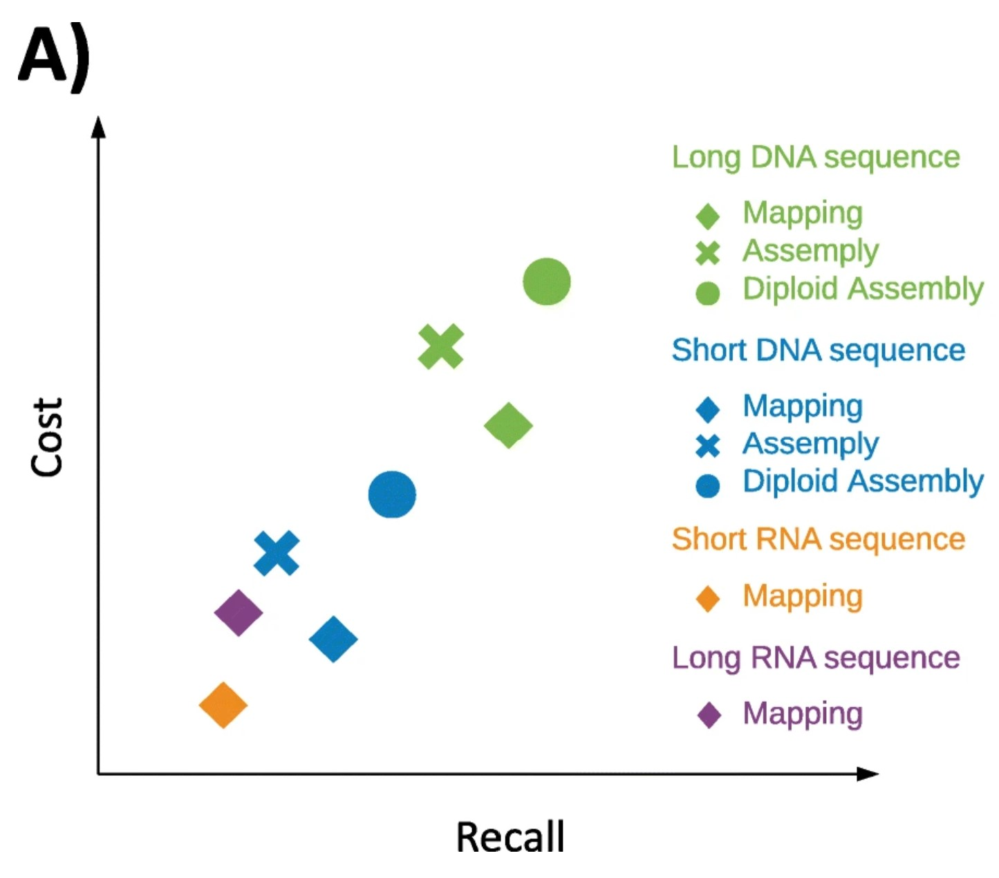
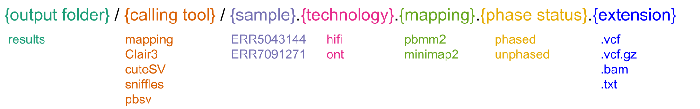
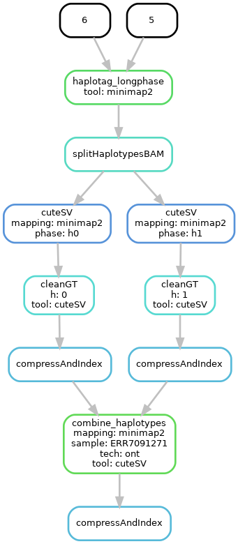

# 1) Intro
We are going to learn how to study structral variants(SV) in cattle genomes using long reads from Pacbio and Oxford nanpore.  We are going to discover and phase  small variants, and SVs using state of the art tools. After that, We are going to calculate population allele frequencies using novel population genotyper tool(The Great Genotyper).  Lastly, We are going to functionally annotate the variants to facilitatle studying the functional impact of the SVs.

## Aims


# 2) Significance 
* Novel way of calculating Population AF without needing  databases like genomAD, and more accurate too.
* Variants will be richly annotated with AF and functional impact making it perfect for studying functional impact of the SVs.
* Workflow is benchmarked on cattle data and achiving accurcy of ~ 90%.
* Workflow is implemented using snakemake to make it simpler to run it afterward with your data and tweak it as you want.

# 3) Terminology
* haplotype-resolved assembly:
* Structrual Variant: genome variation of more than 50bp, it can be insertion, deletion, inversion, duplication, or translocation. 
* Phasing variant
* Population Allele frequency
* Pacbio
* Oxford
* Snakemake
* Variant calling
* genotyping
* Population genotyping 


# 4) Data Description 
We chose sequencing datasets from  haplotype-resolved assembly project(PRJEB42335) of Nellore and Brown_Swiss cross for two reasons: 
1. We can create a gold standard benhcmark by calling the variants from the haplotype-resolved assemblies which is considered to be the accurate method Figure 1.
2. The sample was heavily sequenced using illumina, pacbio(HIFI), and oxford nanpore which allows us to compare the results of differnet metohds.  

||
|:--:|
|Figure 1: Comparison of different methods
Ref:  Mahmoud M, Gobet N, Cruz-Dávalos DI, Mounier N, Dessimoz C, Sedlazeck FJ. Structural variant calling: The long and the short of it. Genome Biology. 2019 Nov 20;20(1):246. 
|

Test Input data for the workshop can be downloaded from the following link and they are available on farm on
```
/home/mshokrof/workshop_12Jan_2023_data/
```

The follwoing table describes the downloaded files 
| file        |  Description  |
|:-------------:|:-------------|
| ARS-UCD1.2_Btau5.0.1Y.25.fa | Chromosome 25 from ARS-UCD1.2 genome|
| ARS-UCD1.2_Btau5.0.1Y.25.rmsk.bed.gz | Repeats annotation of chromosome 25|
| ARS-UCD1.2_Btau5.0.1Y.25.gff.gz | genes annotation of chromosome 25|
| goldstandard/callset_filered.25.vcf.gz | gold standard for variant calling created using the haployte resolved assemblies|
| goldstandard/callset_filered.25.bed.gz | the gold standard in bed format for plotting|
| ERR5043144.chr25 | Hifi reads from sample SAMEA10017982 that maps to chromsome 25|
| ERR7091271.25.fastq.gz | ONT reads from sample SAMEA10017982 that maps to chromsome 25|
| cattle_taurus_10 |  Folder contains Kmer indexes of 10  taurus samples|
| cattle_taurus_10/graph.desc.tsv |  file contains the Biosample ids|
| cattle_indicus_10 |  Folder contains Kmer indexes of 10  indicuis samples|
| cattle_indicus_10/graph.desc.tsv |  file contains the Biosample ids|
| cattle_bostgroup_10 |  Folder contains Kmer indexes of 10  boison samples|
| cattle_bosgroup_10/graph.desc.tsv |  file contains the Biosample ids|

we  created a downsampled the data for the sake of the workshope. We are going to focus on chromsome 25 only, and we are going to calculate the AF in 30 samples(scalable to 4000 samples).

# 5) Workflow:

We created a snakemake script to wrap all the commands in the tutorial. The workflow(summarized in Figure 2) has the following steps: 
  1. map using minmap2/pbmm2
  2. call small variants using clair3 and phase them using longshot
  3. split the reads into two haplotypes
  4. call SV using pbsv, sniffles, cuteSV
  5. merge the small and structrual variants
  6. calculate AF using the great genotyper
  7. annotate the vcf using Variant effect predictor


 
# 6) Let's start configurations
## 6.1 Installing the environment
1. clone this repo:
```
git clone git@github.com:dib-lab/workshop_12Jan_2023.git
cd workshop_12Jan_2023/SV_calling_LR/
``` 
2. create the conda environment and install the tools
```
conda install mamba -n base -c conda-forge
mamba env create -f envs.yaml
conda activate cattle_sv
```

3. make sure that you can access the input files

```
  ls -lsah /home/mshokrof/workshop_12Jan_2023_data/*
```

The workflow expects the input files to be stored in samples_table.csv and subsample_table.csv, and the configurations in config.yaml.
## 6.2 Edit config.yaml
1. open config.yaml using emacs/vim
```
  emacs config.yaml
```
2. change the outputFolder and tempFolder to desired folders. We can just leave the default options
3. close by pressing ctrl+x then ctrl+c
## 6.3 Edit sample_table.csv
We should fill sample_table.csv with the metadata about our datasets. It is in csv format where each row represents a datasets. For each dataset, we add three comma sperated columns:
1. sample_name: id for each dataset
2. sample_type: we define here the type for the datasets using the following types

    | Type        | Defention             |
    | ------------- |:-------------:|
    | ref      | reference genome |
    | gff      | genes annotation of the reference  |
    | rmsk     | repeat annotation of the reference |
    | gold     | gold standard for Variant calling  |
    | ont      | Oxford nanpore sample |
    | hifi     | Pacbio Hifi sample|
    | clr      | Pacbio CLR sample|
3. bioSample: the biosample id of each dataset. 


we are going to define 8 datasets: reference genome, repeat annotation, gene annotation, gold standard vcf format, gold standard bed format, ont sample,  hifi sample, and a cohort graph. 


Open sample_table.csv and Paste the following lines under the header:
```
ucd1.2,ref,SAMN03145444
ucd1.2_gff,gff,SAMN03145444
ucd1.2_rmsk,rmsk,SAMN03145444
NxB,gold,SAMEA7765441
ERR5043144,hifi,SAMEA7765441
ERR7091271,ont,SAMEA7765441
```
Make sure that you specify the sample_type correctly because it changes execution of the workflow. For example, specifying ERR5043144 as hifi will change the mapping tool to pbmm2 and calling parameters in cuteSV.


## 6.4 Edit subsample_table.csv
we are going to specify the files for each dataset. 
open subsample_table.csv using emacs and  copy paste the following lines under header line

```
ucd1.2,/home/mshokrof/workshop_12Jan_2023_data/ARS-UCD1.2_Btau5.0.1Y.25.fa
ucd1.2_rmsk,/home/mshokrof/workshop_12Jan_2023_data/ARS-UCD1.2_Btau5.0.1Y.25.rmsk.bed.gz
ucd1.2_gff,/home/mshokrof/workshop_12Jan_2023_data/ARS-UCD1.2_Btau5.0.1Y.25.gff.gz
NxB,/home/mshokrof/workshop_12Jan_2023_data/goldstandard/callset_filered.25.bed.gz
NxB,/home/mshokrof/workshop_12Jan_2023_data/goldstandard/callset_filered.25.vcf.gz
ERR5043144,/home/mshokrof/workshop_12Jan_2023_data/ERR5043144.chr25.fastq.gz
ERR7091271,/home/mshokrof/workshop_12Jan_2023_data/ERR7091271.chr25.fastq.gz
cattle_taurus_10,/home/mshokrof/workshop_12Jan_2023_data/cohortGraphs/taurus_10/graph.dbg
cattle_taurus_10,/home/mshokrof/workshop_12Jan_2023_data/cohortGraphs/taurus_10/graph.desc.tsv
cattle_taurus_10,/home/mshokrof/workshop_12Jan_2023_data/cohortGraphs/taurus_10/annotation.relaxed.row_diff_int_brwt.annodbg
```

## 6.5 Make sure that configuration is correct
run the following command
```
snakemake -p  -np  results/variants/GG/cattle_taurus_10.ERR7091271.ont.minimap2/annotated/merged.vcf.gz
```
you should expect a dry snakemake run where all the commands will be printed. At this step you can run the workflow with one command "snakemake -j16". However, We are going to run each step individaully while explaining the workflow. 

## 6.6 Workflow basics

* The commands to run the workflow consists of two parts: running mode, and output files path.
* running mode can be either 
    * "-np" instructs snakemake to print the commands and parameters without running anything  
    * "-j 8" instructs snakemake to run the script using 16 threads
* outpath files path follow the pattern the following



```
  # print commands to map ERR5043144  using pbmm2
   snakemake results/mapping/ERR5043144.hifi.pbmm2.bam -np
  
  # print commands to map ERR5043144  using pbmm2 and add haplotag(H0,H1) to the reads
   snakemake results/mapping/ERR5043144.hifi.pbmm2.phased.bam -np
  
  # print commands to map ERR7091271 sample using minimap2
  snakemake results/mapping/ERR7091271.ont.minimap2.bam -np
  
```
  
* Note: Snakemake will determine all the precedent steps in the workflow and execute them.  If you cant follow up the workshop pace, just run the current command and snakemake will catch up. 

  
# 7 Analysis of Oxford nanopore reads (ERR7091271) 
## 7.1 Lets map the reads using minimap2
  
First, Lets look at how the worklfow is going to map the ONT reads
```
snakemake -np results/mapping/ERR7091271.ont.minimap2.bam
```
As you can see, the workflow will start by creating index for the reference genome and then used it to map the reads. 
to actually run the command remove "-np" from the previous command and add '-j8' instead. Snakemake will use 8 threads to run the steps

  
Let's check the quality of the mapping by looking at mapping statistics calculated by [alfredqc](https://www.gear-genomics.com/docs/alfred/)

```
snakemake  -p -j1 results/mapping/ERR7091271.ont.minimap2.alfred.txt
cat results/mapping/ERR7091271.ont.minimap2.alfred.txt
``` 
What is the median coverage?  and median read length?
  

## 7.2 Call and phase small variants using clair3 and longphase

Clair3 step takes the bam file as input and it produces two vcf files: phased and unphased snps. It uses longshot to phase the small variants
Use the following command to run Clair3  
```
snakemake -p -j8 results/clair3/ERR7091271.ont.minimap2.vcf.gz
```
  
Let's check the number of detected variants
  
```
  gzip -dc results/clair3/ERR7091271.ont.minimap2.vcf.gz |grep -vP "^#" |wc -l 
```
  
lets compare the calling result with our gold standard. Notice here that we added --use-conda to the command becuase this command need another conda environemnt
```
snakemake -p -j1 results/benchmarks_small/clair3.ERR7091271.ont.minimap2/result.summary.csv  --use-conda
cut -f1,11,12 -d, results/benchmarks_small/clair3.ERR7091271.ont.minimap2/result.summary.csv
```


  
##  7.3 call SVs
our worlfow supports sv calling using  sniffles, and cuteSV. We are going to try all of them and compare their performance. Only sniffles can produce phased SV when running on haplotagged long reads. I developed a hack for the other tools by splitting the bam files and call sv on each haplotype independently. After that, Phased SV are joined. 




Let's first check the normal running of cuteSV and sniffles
```
snakemake -p -j 8 results/cuteSV/ERR7091271.ont.minimap2.unphased.vcf.gz
```

```
snakemake -p -j 8 results/sniffles/ERR7091271.ont.minimap2.unphased.vcf.gz
```

Let's run give sniffles the phasing option

```
snakemake -p -j 8 results/sniffles/ERR7091271.ont.minimap2.phased.vcf.gz
```
  
Let's run the workflow for phased cuteSV 
  
```
snakemake -p -j 8 results/cuteSV/ERR7091271.ont.minimap2.phased.vcf.gz
```

Let's check the number of detected variants
  
```
  gzip -dc  results/sniffles/ERR7091271.chr25.ont.minimap2.phased.vcf.gz |grep -vP "^#" |wc -l 
```

Which tool produced the most variants?


We can benchmark the result varaints against the gold standard using the following command  
```
snakemake -p -j 1  results/benchmarks/cuteSV.ERR5043144.chr25.hifi.pbmm2.phased/summary.txt
cat results/benchmarks/cuteSV.ERR5043144.chr25.hifi.pbmm2.phased/summary.txt
```
  
Which tool produces the best performance? What is the effect of phasing? 


##  6.10 calcualte AF

```
snakemake -j 16 results/LR_calling/variants/GG/cattle_taurus_10.ERR7091271.chr25.ont.minimap2/merged.vcf.gz
```

## 6.11 annotate using VEP
```
snakemake -j 16 results/LR_calling/variants/GG/cattle_taurus_10.ERR7091271.chr25.ont.minimap2/annotated/merged.vcf.gz
```


## plot a SV
Lets first get high impact variant
```
zgrep "|HIGH|" results/LR_calling/variants/GG/cattle_taurus_10.ERR7091271.chr25.ont.minimap2/annotated/merged.vcf.gz 
```

lets visualize 
```
snakemake -np ../results/LR_calling/samplot/DEL_25_41669173_41669210.png
```


