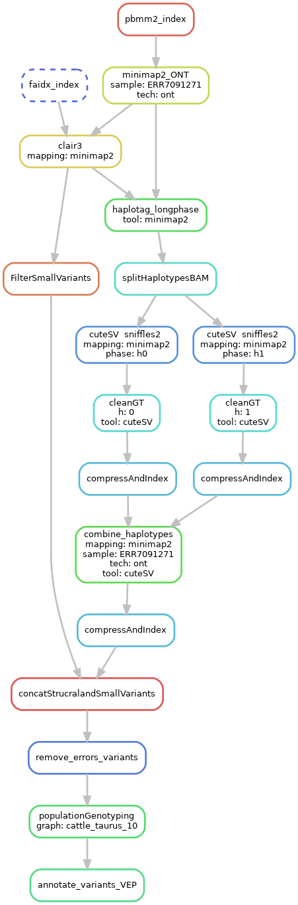

# Intro
We are going to learn how to study structral variants(SV) in cattle genomes using long reads from Pacbio and Oxford nanpore. First, We are going to discover and phase  small variants, and SVs using state of the art tools. After that, We are going to calculate population allele frequencies using novel population genotyper tool(The Great Genotyper).  Lastly, We are going to functionally annotate the variants to facilitatle studying the functional impact of the SVs.

We chose sequencing datasets from  haplotype-resolved assembly project(PRJEB42335) of Nellore and Brown_Swiss cross for two reasons: First, We can create a gold standard benhcmark by calling the variants from the haplotype-resolved assemblies which is considered to be the accurate method Figure 1. Second, the sample was heavily sequenced using illumina, pacbio(HIFI), and oxford nanpore which allows us to compare the results of differnet metohds.  Lastly, we  created a downsampled the data for the sake of the workshope. We are going to focus on chromsome 25 only, and we are going to calculate the AF in 30 samples(scalable to 4000 samples). 


||
|:--:|
|Figure 1: Comparison of different methods
Ref:  Mahmoud M, Gobet N, Cruz-Dávalos DI, Mounier N, Dessimoz C, Sedlazeck FJ. Structural variant calling: The long and the short of it. Genome Biology. 2019 Nov 20;20(1):246. 
|


# Data Description 
Test Input data for the workshop can be downloaded from the following link. 
Data description is
| file        |  Description  |
|:-------------:|:-------------|
| ARS-UCD1.2_Btau5.0.1Y.25.fa | Chromosome 25 from ARS-UCD1.2 genome|
| ARS-UCD1.2_Btau5.0.1Y.25.rmsk.bed.gz | Repeats annotation of chromosome 25|
| ARS-UCD1.2_Btau5.0.1Y.25.gff.gz | genes annotation of chromosome 25|
| goldstandard/callset_filered.25.vcf.gz | gold standard for variant calling created using the haployte resolved assemblies|
| goldstandard/callset_filered.25.bed.gz | the gold standard in bed format for plotting|
| ERR5043144.chr25 | Hifi reads from sample SAMEA10017982 that maps to chromsome 25|
| ERR7091271.25.fastq.gz | ONT reads from sample SAMEA10017982 that maps to chromsome 25|
| cattle_taurus_10 |  Folder contains Kmer indexes of 10  taurus samples|
| cattle_taurus_10/graph.desc.tsv |  file contains the Biosample ids|
| cattle_indicus_10 |  Folder contains Kmer indexes of 10  indicuis samples|
| cattle_indicus_10/graph.desc.tsv |  file contains the Biosample ids|
| cattle_bostgroup_10 |  Folder contains Kmer indexes of 10  boison samples|
| cattle_bosgroup_10/graph.desc.tsv |  file contains the Biosample ids|


# Workflow:

We created a snakemake script to wrap all the commands in the tutorial. The workflow(summarized in Figure 2) has the following steps: 
  1. map using minmap2
  2. call small variants using clair3
  3. Phase small variants using longshot
  4. split the reads into two haplotypes
  5. call SV using pbsv, sniffles, cuteSV
  6. merge the small and structrual variants
  7. annotate the vcf using Variant effect predictor
  8. calculate AF using the great genotyper




 
# Let's start
## Installing the environment
1. install conda using the following link https://docs.conda.io/projects/conda/en/latest/user-guide/install/index.html
2. create the conda environment and install the tools
```
conda install mamba -n base -c conda-forge
mamba env create -f envs.yaml
mamba activate cattle_sv
```
The workflow expects the input files to be stored in samples_table.csv and subsample_table.csv, and the configurations in config.yaml.
## Edit config.yaml
1. change the outputFolder to desired output folder. We can choose "results/"
2. change the tempFolder to desired temporary folder. We can choose "scratch/"
## Edit sample_table.csv
we are going to define 7 datasets: reference genome, repeat annotation, gene annotation, gold standard vcf format, gold standard bed format, ont sample, and hifi sample. 

The file should be like the following:
```
sample_name,library,Breed,BioSample
ucd1.2,ref,Hereford,HEREFORD
ucd1.2_gff,gff,Hereford,HEREFORD
ucd1.2_rmsk,rmsk,Hereford,HEREFORD
goldbed,gold_bed,NelloreXBrown_Swiss,SAMEA7765441
goldvcf,gold_vcf,NelloreXBrown_Swiss,SAMEA7765441
ERR5043144.chr25,hifi,NelloreXBrown_Swiss,SAMEA7765441
ERR7091271.chr25,ont,NelloreXBrown_Swiss,SAMEA7765441
```
Make sure that you specify the library correctly because it changes how the execution of the workflow. For example, specifying ERR5043144.chr25 as hifi will change the mapping tool to pbmm2 and calling parameters in cuteSV.


## Edit subsample_table.csv
we are going to specify the files for each dataset. write the file paths of the downloaded data 
The file should be like the following:
```
sample_name,file
ucd1.2,../data/ARS-UCD1.2_Btau5.0.1Y.25.fa
ucd1.2_rmsk,../data/ARS-UCD1.2_Btau5.0.1Y.25.rmsk.bed.gz
ucd1.2_gff,../data/ARS-UCD1.2_Btau5.0.1Y.25.gff.gz
goldbed,../data/goldstandard/callset_filered.25.bed.gz
goldvcf,../data/goldstandard/callset_filered.25.vcf.gz
ERR5043144.chr25,../data/NxB.HIFI.chr25.fastq.gz
ERR7091271.chr25,../data/ERR7091271.25.fastq.gz
cattle_taurus_10,/group/ctbrowngrp/mshokrof/cattle/metagraph_taurus_10/smooth_10000000/graph.dbg
cattle_taurus_10,/group/ctbrowngrp/mshokrof/cattle/metagraph_taurus_10/smooth_10000000/graph.desc.tsv
cattle_taurus_10,/group/ctbrowngrp/mshokrof/cattle/metagraph_taurus_10/smooth_10000000/annotation.relaxed.row_diff_int_brwt.annodbg
```

## Make sure that configurationa is correct
run the following command
```
snakemake  -np  ../results/LR_calling/variants/GG/cattle_taurus_10.ERR7091271.chr25.ont.minimap2/annotated/merged.vcf.gz
```
you should expect a dry snakemake run where all the commands will be printed. At this step you can run the workflow with one command "snakemake -j16". However, We are going to run each step individaully while explaining the workflow. 

## Lets Map the reads
First, Lets look at how the worklfow is going to map the ONT reads
```
snakemake -np results/LR_calling/mapping/ERR7091271.chr25.ont.minimap2.bam
```
As you can see, the workflow will start by creating index for the reference genome and then used it to map the reads. 
to actually run the command remove "-np" from the previous command and add '-j16' instead. Snakemake will use 16 threads to run the steps

## use Clair3 to call and phase small variants

```
snakemake -j16 results/LR_calling/small_variants/clair3/ERR7091271.chr25.ont.minimap2.vcf.gz
```


## call SV useing cuteSV

```
snakemake -j 16 results/LR_calling/cuteSV/ERR7091271.chr25.ont.minimap2.phased.vcf.gz
```

## Benchmark the results

```
snakemake -j 16  results/LR_calling/benchmarks/cuteSV.ERR5043144.chr25.hifi.pbmm2.phased/summary.txt
cat results/LR_calling/benchmarks/cuteSV.ERR5043144.chr25.hifi.pbmm2.phased/summary.txt
```


## calcualte AF

```
snakemake -j 16 results/LR_calling/variants/GG/cattle_taurus_10.ERR7091271.chr25.ont.minimap2/merged.vcf.gz
```

## annotate using VEP
```
snakemake -j 16 results/LR_calling/variants/GG/cattle_taurus_10.ERR7091271.chr25.ont.minimap2/annotated/merged.vcf.gz
```


## plot a SV
Lets first get high impact variant
```
zgrep "|HIGH|" results/LR_calling/variants/GG/cattle_taurus_10.ERR7091271.chr25.ont.minimap2/annotated/merged.vcf.gz 
```

lets visualize 
```
snakemake -np ../results/LR_calling/samplot/DEL_25_41669173_41669210.png
```


